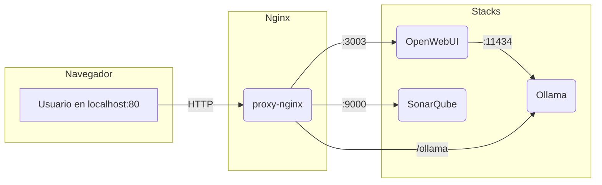

# Docker Local Ecosystem

Ecosistema local de servicios Docker para desarrollo y pruebas: proxy Nginx, IA (Ollama + OpenWebUI + Fooocus opcional), SonarQube y utilidades.

---

## 🗺️ Esquema de arquitectura



---

## Servicios incluidos

- **Nginx** (proxy-nginx): Proxy inverso y página de inicio.
- **Ollama**: Servidor de modelos LLM locales.
- **OpenWebUI**: Interfaz web para trabajar con Ollama.
- **Fooocus API (experimental)**: Generación de imágenes (requiere GPU; soporta fallback CPU si no hay soporte CUDA para tu arquitectura).
- **SonarQube**: Análisis de calidad de código.

---

## Instalación y arranque

1. Asegúrate de tener Docker y Docker Compose instalados.
2. Clona este repositorio y sitúate en la raíz del proyecto.
3. Ejecuta uno de estos scripts según tu sistema:

### En Linux/Mac/WSL
```bash
git clone https://github.com/karba98/docker-local-ecosystem.git
cd docker-local-ecosystem
bash start-ecosystem.sh
```

### En Windows (PowerShell)
```powershell
git clone https://github.com/karba98/docker-local-ecosystem.git
cd docker-local-ecosystem
./start-ecosystem.ps1
```

---

## Scripts de arranque

Ambos scripts (`start-ecosystem.sh` y `start-ecosystem.ps1`) permiten levantar selectivamente los stacks.

### PowerShell (`start-ecosystem.ps1`) parámetros

```
    # Docker Local Ecosystem

    Ecosistema reproducible para experimentar localmente con: proxy Nginx, LLMs (Ollama + OpenWebUI), generación de imágenes (Fooocus), análisis de calidad (SonarQube) y utilidades. Orientado a desarrollo iterativo rápido y pruebas sobre una única red compartida (`proxy-network`).

    ---

    ## 🗺️ Arquitectura actualizada

    ```mermaid
    flowchart LR
        subgraph Client
            U[Usuario<br/>http://localhost]
        end

        subgraph proxy-network
            subgraph Nginx
                N[proxy-nginx]
            end
            subgraph AI[stack-ai]
                OW(OpenWebUI)
                OL(Ollama)
                F(Fooocus API)
            end
            subgraph SQ[stack-sonarqube]
                S(SonarQube)
            end
        end

        U -->|HTTP 80| N
        N -->|/ollama → 11434| OL
        N -->|/openwebui :3003| OW
        N -->|/fooocus :3004| F
        N -->|/sonarqube :9000| S
        OW -->|REST| OL
        F -. opcional .- OL
    ```

    Características clave:
    * Una sola red externa (`proxy-network`).
    * Acceso unificado vía Nginx (puerto 80) a los servicios web.
    * OpenWebUI consume Ollama internamente (sin exponer 11434 públicamente si no deseas).
    * Fooocus expone API HTTP (8084 interno → 3004 host) con fallback automático a CPU.
    * SonarQube accesible en `/sonarqube` (puerto interno 9000) si el stack está levantado.

    ---

    ## Stacks

    | Nombre lógico | Ruta                         | Descripción |
    |---------------|------------------------------|-------------|
    | Principal      | `./`                        | Nginx + página índice estática |
    | stack-ai       | `./stack-ai`                | Ollama, OpenWebUI, Fooocus (build local) |
    | stack-sonarqube| `./stack- sonarqube`        | SonarQube (server + required DB) |

    Puedes iniciar cualquiera en aislamiento o combinarlos.

    ---

    ## Servicios incluidos

    * **proxy-nginx**: Reverse proxy & landing page.
    * **Ollama**: Servidor de modelos LLM (pull dinámico de modelos).
    * **OpenWebUI**: Interfaz rica para interactuar con Ollama.
    * **Fooocus API (experimental)**: Generación de imágenes / text-to-image.
    * **SonarQube**: Plataforma de calidad y seguridad de código.

    ---

    ## Requisitos previos

    * Docker Engine + Docker Compose plugin.
    * (Opcional GPU) Drivers NVIDIA + `nvidia-container-toolkit` si vas a usar Ollama con GPU o Fooocus acelerado.
    * PowerShell 7+ en Windows (o WSL) para mejor experiencia.

    ---

    ## Instalación rápida

    Clona y ejecuta el script según tu OS:

    ### Linux / macOS / WSL
    ```bash
    git clone https://github.com/karba98/docker-local-ecosystem.git
    cd docker-local-ecosystem
    ./start-ecosystem.sh -Auto
    ```

    ### Windows (PowerShell)
    ```powershell
    git clone https://github.com/karba98/docker-local-ecosystem.git
    cd docker-local-ecosystem
    ./start-ecosystem.ps1 -Auto
    ```

    El flag `-Auto` selecciona todos los stacks detectados.

    ---

    ## Scripts de orquestación

    Ambos scripts tienen paridad funcional. Seleccionan, construyen (si procede) y levantan stacks. Auto-actualizan el repo (`git pull --rebase`) al inicio.

    ### PowerShell (`start-ecosystem.ps1`)
    Parámetros:
    ```
    -Stacks <lista>   Selección no interactiva (ej: -Stacks Principal stack-ai)
    -Auto             Selecciona todos los stacks (sincroniza con -Stacks si no se pasa lista)
    -SkipBuild        No ejecuta docker compose build
    -BuildOnly        Construye imágenes y sale sin levantar
    -NoPull           Evita --pull durante build
    -NoCache          Fuerza rebuild completo (--no-cache)
    -List             Lista stacks detectados y sale
    ```
    Ejemplos:
    ```powershell
    ./start-ecosystem.ps1                     # Modo interactivo
    ./start-ecosystem.ps1 -List               # Ver stacks
    ./start-ecosystem.ps1 -Auto               # Todos
    ./start-ecosystem.ps1 -Stacks stack-ai    # Sólo IA
    ./start-ecosystem.ps1 -Stacks stack-ai -BuildOnly
    ./start-ecosystem.ps1 -Stacks Principal stack-ai -NoCache -NoPull
    ./start-ecosystem.ps1 -Auto -SkipBuild
    ```

    ### Bash (`start-ecosystem.sh`)
    Parámetros:
    ```
    -Stacks <lista>   Selección no interactiva (Principal stack-ai stack-sonarqube All)
    -Auto             Selecciona todos
    -SkipBuild        No construye imágenes
    -BuildOnly        Sólo build y salir
    -NoPull           Omite --pull
    -NoCache          Usa --no-cache
    -List             Lista stacks y sale
    ```
    Ejemplos:
    ```bash
    ./start-ecosystem.sh -List
    ./start-ecosystem.sh -Stacks stack-ai
    ./start-ecosystem.sh -Stacks Principal stack-ai -BuildOnly
    ./start-ecosystem.sh -Auto -NoCache -NoPull
    ./start-ecosystem.sh -Auto -SkipBuild
    ```

    Notas internas:
    * Orden de build: stacks secundarios → principal (para reutilizar capas comunes y no bloquear nginx antes de tiempo).
    * `-SkipBuild` ignora `-NoCache` / `-NoPull` (ya se advierte en consola).

    ---

    ## Fooocus API (experimental)

    Ubicado en `stack-ai`. Construido desde `Dockerfile.fooocus-gpu`.

    Resumen técnico:
    * Base: `nvidia/cuda:12.8.0-runtime-ubuntu22.04`.
    * Instalación forzada de `torch==2.7.0+cu128` (soporte RTX 50xx / sm_120).
    * Fallback CPU automático si inicialización CUDA falla (script `start.sh`).
    * Volumen persistente `fooocus-cache` para modelos/pesos.
    * Puerto interno 8084 → host `http://localhost:3004`.

    Build Args (en `stack-ai/docker-compose.yml`):
    | Arg | Valor por defecto | Descripción |
    |-----|-------------------|-------------|
    | `INSTALL_TOOLKIT` | `0` | Si `1`, instala toolkit completo (compiladores / headers). Más lento. |
    | `TORCH_FORCE_VERSION` | `2.7.0+cu128` | Versión exacta que se reinstala tras clonar Fooocus. |

    Para activar toolkit y reconstruir sólo Fooocus:
    ```powershell
    cd stack-ai
    docker compose build --no-cache fooocus-api
    docker compose up -d fooocus-api
    ```

    Pasar argumentos a Fooocus: descomenta `CLI_ARGS` en la sección `environment` del servicio y añade flags (ej: `--always-download-new-model`).

    Forzar CPU permanente: descomenta `CUDA_VISIBLE_DEVICES=` (valor vacío) en `environment`.

    Logs en tiempo real:
    ```powershell
    docker logs -f fooocus-api
    ```

    ### Problemas comunes Fooocus
    | Síntoma | Causa probable | Acción |
    |---------|----------------|--------|
    | Mensaje sobre arquitectura no soportada | GPU muy reciente (sm_120) | Esperar fallback CPU o instalar toolkit y reconstruir |
    | OOM / memoria insuficiente | Modelos demasiado grandes | Reducir resolución, batch o usar CPU temporalmente |
    | Descargas lentas | Red o sin cache | Verificar volumen `fooocus-cache` montado |

    ---

    ## SonarQube

    Stack opcional `stack-sonarqube`. Puedes añadir un archivo `sonar-project.properties` en la raíz de tu proyecto a analizar y lanzar el scanner localmente apuntando a la URL de SonarQube dentro de la red o vía proxy.

    Ejemplo mínimo de `sonar-project.properties`:
    ```
    sonar.projectKey=demo
    sonar.projectName=Demo
    sonar.sources=.
    sonar.sourceEncoding=UTF-8
    ```

    Accede a la interfaz: `http://localhost/sonarqube` (o puerto directo 9000 si lo expones).

    ---

    ## Volúmenes y persistencia

    | Volumen | Servicio | Contenido |
    |---------|----------|-----------|
    | `open-webui` | OpenWebUI | Datos / historial / configuración |
    | `fooocus-cache` | Fooocus | Modelos y pesos descargados |

    Puedes listar volúmenes: `docker volume ls`.

    ---

    ## Red compartida

    Se crea automáticamente `proxy-network` si no existe. Es externa, de modo que puedes acoplar otros stacks propios usando:
    ```bash
    docker network connect proxy-network <otro-contenedor>
    ```

    ---

    ## Troubleshooting rápido

    | Problema | Diagnóstico rápido | Solución |
    |----------|--------------------|----------|
    | Puerto 80 en uso | `netstat -ano | find "0.0.0.0:80"` | Libera IIS / otro proxy / cambia puerto en `docker-compose.yml` principal |
    | GPU no detectada | `docker run --rm --gpus all nvidia/cuda:12.8.0-runtime-ubuntu22.04 nvidia-smi` | Instala / reconfigura `nvidia-container-toolkit` |
    | Fooocus lento | Fallback CPU | Activa GPU corrigiendo drivers o ajusta INSTALL_TOOLKIT=1 y rebuild |
    | OpenWebUI no ve modelos | Ollama no arrancó aún | Revisa `docker logs ollama` |
    | SonarQube tarda en iniciar | Inicialización DB | Esperar (primer arranque puede ser 2-3 min) |

    Ver logs de todos:
    ```bash
    docker ps --format 'table {{.Names}}\t{{.Status}}'
    docker logs -f <nombre-contenedor>
    ```

    ---

    ## Actualizaciones

    Los scripts ejecutan `git pull --rebase` al inicio. Si tienes cambios locales que no quieres sobrescribir, realiza un commit antes de lanzar el script.

    ---

    ## Estructura del repositorio
    ```text
    ├── docker-compose.yml              # Stack principal (proxy + landing)
    ├── stack-ai/
    │   ├── docker-compose.yml          # Ollama, OpenWebUI, Fooocus
    │   ├── Dockerfile.fooocus-gpu      # Build CUDA / Torch personalizado
    │   ├── entrypoint.sh               # Entrypoint para Ollama
    │   └── start.sh                    # Script arranque Fooocus (fallback CPU)
    ├── stack- sonarqube/
    │   └── docker-compose.yml          # SonarQube
    ├── static/                         # Recursos estáticos web
    ├── index.html                      # Landing
    ├── nginx.conf                      # Config proxy
    ├── start-ecosystem.sh              # Script Bash
    ├── start-ecosystem.ps1             # Script PowerShell
    └── README.md
    ```

    ---

    ## Roadmap (ideas futuras)
    * Output JSON opcional para scripts (-Json) -> integración CI.
    * Métricas básicas (tiempos de build) almacenadas en un archivo temporal.
    * Endpoint de salud consolidado en Nginx (/health) agregando checks de servicios.
    * Integración opcional de vector store / RAG.

    ---

    ## Créditos
    * [OpenWebUI](https://github.com/open-webui/open-webui)
    * [Ollama](https://github.com/jmorganca/ollama)
    * [Fooocus](https://github.com/lllyasviel/Fooocus)
    * [SonarQube](https://www.sonarqube.org/)
    * [Bootstrap](https://getbootstrap.com/)

    ---

    Contribuciones y sugerencias bienvenidas. Crea un issue o PR. ⭐