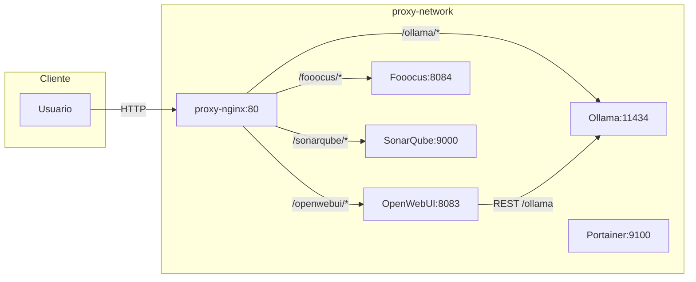

# Docker Local Ecosystem 🐳🚀

Ecosistema local: Nginx, Ollama, OpenWebUI, Fooocus (imágenes), SonarQube.

---
## 🗺️ Esquema de arquitectura

Rutas: /ollama/ /openwebui/ /fooocus/ /sonarqube/  (Portainer vía puerto 9100 directo o proxy host)

---
## 🔧 Servicios
- proxy-nginx
- Ollama (LLMs)
- OpenWebUI (UI)
- Fooocus API (texto→imagen, fallback CPU)
- SonarQube (calidad código)
- Portainer (gestión Docker)
    - Acceso: http://localhost:9100 (o 9443 HTTPS)

---
## 🧱 Stacks
| Nombre | Ruta | Contenido |
|--------|------|-----------|
| Principal | ./ | Nginx Proxy Manager |
| Portainer | (en principal) | Gestión visual de contenedores (http://localhost:9100) |
| stack-ai | ./stack-ai | Ollama, OpenWebUI, Fooocus |
| stack-sonarqube | ./stack- sonarqube | SonarQube + Postgres |

---
## ✅ Requisitos
Docker + Compose. (GPU) Drivers NVIDIA + nvidia-container-toolkit.

---
## ⚡ Instalación rápida
Linux / macOS / WSL:
```bash
git clone https://github.com/karba98/docker-local-ecosystem.git
cd docker-local-ecosystem
./start-ecosystem.sh -Auto
```
Windows (PowerShell):
```powershell
git clone https://github.com/karba98/docker-local-ecosystem.git
cd docker-local-ecosystem
./start-ecosystem.ps1 -Auto
```

---
## 🛠️ Scripts (PowerShell / Bash)
Parámetros:
```
-Stacks <lista>   Principal stack-ai stack-sonarqube All
-Auto             Todos los stacks
-SkipBuild        No build
-BuildOnly        Solo construir
-NoPull           Sin --pull
-NoCache          Rebuild completo
-List             Lista y sale
```
Ejemplos PowerShell:
```powershell
./start-ecosystem.ps1 -List
./start-ecosystem.ps1 -Stacks stack-ai
./start-ecosystem.ps1 -Stacks Principal stack-ai -NoCache -NoPull
```
Ejemplos Bash:
```bash
./start-ecosystem.sh -Auto
./start-ecosystem.sh -Stacks stack-ai -BuildOnly
```
Notas: build de secundarios → principal. `-SkipBuild` ignora `-NoPull` y `-NoCache`.

---
## 🎨 Fooocus API
Base CUDA 12.8 (runtime), fuerza torch 2.7.0+cu128 (RTX 50xx), fallback CPU. Puerto interno 8084.

Build args (`stack-ai/docker-compose.yml`):
| Arg | Valor | Descripción |
|-----|-------|-------------|
| INSTALL_TOOLKIT | 0 | Instalar toolkit completo CUDA (si=1 más lento) |
| TORCH_FORCE_VERSION | 2.7.0+cu128 | Versión torch forzada |

Rebuild:
```bash
cd stack-ai
docker compose build --no-cache fooocus-api
docker compose up -d fooocus-api
```
CLI Args: descomenta `CLI_ARGS`. Forzar CPU: `CUDA_VISIBLE_DEVICES=` vacío.

Problemas comunes:
| Síntoma | Causa | Acción |
|---------|-------|--------|
| Arquitectura no soportada | GPU muy nueva | Fallback o INSTALL_TOOLKIT=1 y rebuild |
| OOM | VRAM insuficiente | Reducir resolución / batch |
| Descarga lenta | Sin cache | Revisar volumen `fooocus-cache` |

---
## 🧪 SonarQube
Ejemplo `sonar-project.properties`:
```
sonar.projectKey=demo
sonar.projectName=Demo
sonar.sources=.
sonar.sourceEncoding=UTF-8
```
Ruta: /sonarqube/

---
## 💾 Volúmenes
| Volumen | Uso |
|---------|-----|
| open-webui | Datos OpenWebUI |
| fooocus-cache | Modelos/Pesos Fooocus |
| portainer-data | Datos Portainer |

---
## 🌐 Red
Red externa: `proxy-network`.
```bash
docker network connect proxy-network <contenedor>
```

---
## 🩺 Troubleshooting
| Problema | Pista | Solución |
|----------|-------|----------|
| Puerto 80 ocupado | netstat/lsof | Liberar o cambiar puerto |
| GPU no detectada | nvidia-smi en contenedor | Revisar drivers/toolkit |
| Fooocus sólo CPU | logs fallback | Rebuild / toolkit |
| OpenWebUI sin modelos | logs ollama | Esperar arranque Ollama |
| SonarQube lento | logs iniciales | Esperar primer arranque |
| /bin/bash^M bad interpreter | Clonado con CRLF | Rebuild (Dockerfile limpia CR) |
| sleep: invalid time interval '5\r' | CRLF en `entrypoint.sh` | Re-clonar (autofix .gitattributes) o `sed -i 's/\r$//' stack-ai/entrypoint.sh` |

Logs:
```bash
docker ps --format 'table {{.Names}}\t{{.Status}}'
docker logs -f <contenedor>
```

---
## 🛡️ Garantía de scripts en contenedores
Medidas para asegurar que `entrypoint.sh` y `start.sh` se copian correctamente:
1. `.gitattributes` fuerza fin de línea LF en scripts (`*.sh`) evitando `^M`.
2. `Dockerfile.fooocus-gpu` copia `start.sh` en la última capa (cambios rápidos sin reinstalar deps).
3. Permisos ajustados (`chmod 755`).
4. Puedes montar el script directamente para iterar:
    ```yaml
    # docker-compose.yml (fooocus-api)
    volumes:
      - ./start.sh:/app/start.sh:ro
    ```
5. Si ves "permission denied":
    ```bash
    git update-index --chmod=+x stack-ai/start.sh stack-ai/entrypoint.sh
    docker compose build fooocus-api
    ```
6. Forzar limpieza de capas si persiste un script viejo:
    ```bash
    docker builder prune -f
    docker compose build --no-cache fooocus-api
    ```
7. Verificar hash dentro del contenedor:
    ```bash
    docker exec fooocus-api sha256sum /app/start.sh
    sha256sum stack-ai/start.sh
    ```
8. Para `entrypoint.sh` (ollama) ya se usa bind mount `./entrypoint.sh:/entrypoint.sh:ro` (si lo editas, basta reiniciar el contenedor).
9. Variable `OLLAMA_AUTO_PULL` permite elegir modelo inicial (por defecto llama2). `OLLAMA_MAX_WAIT` controla espera de readiness.
10. Las carpetas `data/nginx-proxy-manager/{data,letsencrypt}` se crean automáticamente si no existen al levantar el stack principal.
11. Si existía un contenedor antiguo `proxy-nginx` basado en `nginx:latest` se elimina automáticamente antes de levantar Nginx Proxy Manager para evitar servir un `index.html` obsoleto.
12. Portainer se inicia junto al stack principal; acceso inicial: http://localhost:9100 (crear usuario admin la primera vez).

Problemas típicos tras clonar en máquina nueva:
| Síntoma | Causa | Fix |
|---------|-------|-----|
| `bash
: not found` | Fin de línea CRLF en *.sh | `git config core.autocrlf false` y reclonar / usar `.gitattributes` ya incluido |
| `permission denied` | Bit de ejecución perdido | `git update-index --chmod=+x file` y rebuild |
| Script viejo tras editar | Cache de capas | Mover COPY al final (ya hecho) o `--no-cache` |
| Cambios no reflejados en `entrypoint.sh` | No reiniciaste contenedor | `docker compose restart ollama` |


---
## 📁 Estructura
```text
├── docker-compose.yml
├── stack-ai/
│   ├── docker-compose.yml
│   ├── Dockerfile.fooocus-gpu
│   ├── entrypoint.sh
│   └── start.sh
├── stack- sonarqube/
│   └── docker-compose.yml
├── data/
│   └── nginx-proxy-manager/
├── start-ecosystem.sh
├── start-ecosystem.ps1
└── README.md
```

---
## 🗓️ Roadmap
* Salida JSON (-Json)
* Endpoint /health
* Métricas de build

---
## 🙏 Créditos
OpenWebUI · Ollama · Fooocus · SonarQube · Bootstrap

---
Contribuciones bienvenidas ⭐