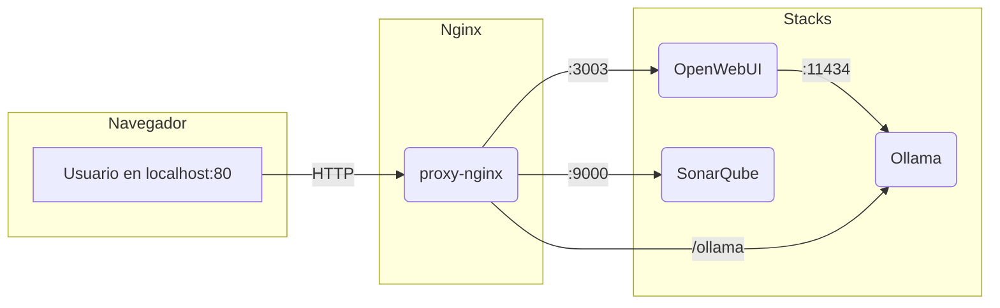

# 🚀 Docker Local Ecosystem

Un ecosistema local de servicios Docker para desarrollo y pruebas, con Nginx como proxy, OpenWebUI, SonarQube y gestión sencilla de modelos Ollama.

---

## 🗺️ Esquema de arquitectura



---

## 📦 Servicios incluidos

- 🌐 **Nginx**: Proxy inverso y página de inicio moderna.
- 🤖 **OpenWebUI**: Interfaz web para LLMs y Ollama.
- 🛡️ **SonarQube**: Análisis de calidad de código.
- 🦙 **Ollama**: Servidor de modelos LLM locales.

---

## ⚡ Instalación y arranque

1. Asegúrate de tener Docker y Docker Compose instalados.
2. Clona este repositorio y sitúate en la raíz del proyecto.
3. Ejecuta uno de estos scripts según tu sistema:

### En Linux/Mac/WSL:
```bash
git clone https://github.com/karba98/docker-local-ecosystem.git
cd docker-local-ecosystem
bash start-ecosystem.sh
```

### En Windows (PowerShell):
```powershell
git clone https://github.com/karba98/docker-local-ecosystem.git
cd docker-local-ecosystem
./start-ecosystem.ps1
```

---

## 📝 Notas útiles

- El script te permite elegir qué stacks levantar o lanzar todo el ecosistema.
- Se actualiza automáticamente desde GitHub al arrancar.
- Si algún contenedor falla, el script lo intenta arrancar de nuevo y te avisa si sigue caído.
- Para actualizar la configuración de nginx sin reiniciar el contenedor:

```bash
docker exec proxy-nginx nginx -s reload
```

---

## 📂 Estructura del proyecto

```text
├── docker-compose.yml           # Stack principal (nginx)
├── stack-ai/
│   └── docker-compose.yml       # Stack de IA (Ollama, OpenWebUI)
├── stack- sonarqube/
│   └── docker-compose.yml       # Stack de SonarQube
├── static/                      # Recursos estáticos (Bootstrap, iconos, logos)
├── index.html                   # Página de inicio
├── nginx.conf                   # Configuración de Nginx
├── start-ecosystem.sh           # Script de arranque (bash)
├── start-ecosystem.ps1          # Script de arranque (PowerShell)
└── ...
```

---

## 💡 Créditos y recursos

- [OpenWebUI](https://github.com/open-webui/open-webui)
- [Ollama](https://github.com/jmorganca/ollama)
- [SonarQube](https://www.sonarqube.org/)
- [Bootstrap](https://getbootstrap.com/)

---

¡Contribuciones y sugerencias bienvenidas! ⭐