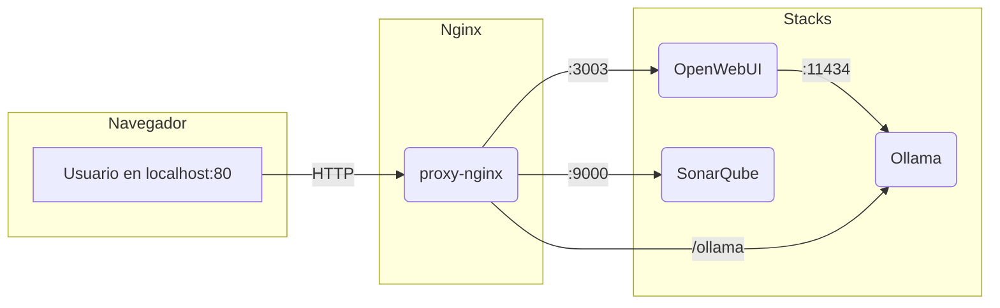

# Docker Local Ecosystem

Ecosistema local de servicios Docker para desarrollo y pruebas: proxy Nginx, IA (Ollama + OpenWebUI + Fooocus opcional), SonarQube y utilidades.

---

## 🗺️ Esquema de arquitectura



---

## Servicios incluidos

- **Nginx** (proxy-nginx): Proxy inverso y página de inicio.
- **Ollama**: Servidor de modelos LLM locales.
- **OpenWebUI**: Interfaz web para trabajar con Ollama.
- **Fooocus API (experimental)**: Generación de imágenes (requiere GPU; soporta fallback CPU si no hay soporte CUDA para tu arquitectura).
- **SonarQube**: Análisis de calidad de código.

---

## Instalación y arranque

1. Asegúrate de tener Docker y Docker Compose instalados.
2. Clona este repositorio y sitúate en la raíz del proyecto.
3. Ejecuta uno de estos scripts según tu sistema:

### En Linux/Mac/WSL
```bash
git clone https://github.com/karba98/docker-local-ecosystem.git
cd docker-local-ecosystem
bash start-ecosystem.sh
```

### En Windows (PowerShell)
```powershell
git clone https://github.com/karba98/docker-local-ecosystem.git
cd docker-local-ecosystem
./start-ecosystem.ps1
```

---

## Scripts de arranque

Ambos scripts (`start-ecosystem.sh` y `start-ecosystem.ps1`) permiten levantar selectivamente los stacks.

### PowerShell (`start-ecosystem.ps1`) parámetros

```
    -Stacks <lista>    Selección no interactiva (ej: -Stacks Principal stack-ai)
    -Auto              Equivalente a seleccionar todos los stacks (combina con otros flags)
    -SkipBuild         No ejecuta docker compose build
    -BuildOnly         Construye imágenes y sale sin levantar
    -NoPull            Evita --pull en build
    -NoCache           Fuerza rebuild completo (--no-cache)
    -List              Lista stacks detectados y sale
```

Ejemplos:

```powershell
./start-ecosystem.ps1 -Auto
./start-ecosystem.ps1 -Stacks stack-ai -NoCache -NoPull
./start-ecosystem.ps1 -Stacks Principal stack-ai -BuildOnly
./start-ecosystem.ps1 -Auto -SkipBuild
```

### Bash (`start-ecosystem.sh`) parámetros

```
    -Stacks <lista>    Selección no interactiva (ej: -Stacks Principal stack-ai)
    -Auto              Selecciona todos los stacks
    -SkipBuild         No ejecuta docker compose build
    -BuildOnly         Construye imágenes y sale sin levantar
    -NoPull            Evita --pull en build
    -NoCache           Fuerza rebuild completo (--no-cache)
    -List              Lista stacks detectados y sale
```

Ejemplos:

```bash
./start-ecosystem.sh -Auto
./start-ecosystem.sh -Stacks stack-ai -NoCache -NoPull
./start-ecosystem.sh -Stacks Principal stack-ai -BuildOnly
./start-ecosystem.sh -Auto -SkipBuild
```

## Fooocus API (experimental)

Incluido dentro de `stack-ai` como build local (`Dockerfile.fooocus-gpu`).

Características:
- Imagen base PyTorch CUDA 12.x.
- Script de arranque con fallback a CPU si la GPU no está soportada.
- Expuesto en `http://localhost:3004` (puerto interno 8084).
- Build Args opcionales (en `stack-ai/docker-compose.yml`):
  - `INSTALL_TOOLKIT=1` instala el toolkit completo de CUDA 12.8 dentro de la imagen (más lento, sólo si realmente lo necesitas para compilar extensiones adicionales).
  - `TORCH_FORCE_VERSION` versión exacta de torch que se reinstala (por defecto `2.7.0+cu128`).

### GPUs muy nuevas (RTX 50xx / sm_120)

Se fuerza la instalación de `torch==2.7.0+cu128` para soportar arquitecturas recientes. El contenedor usa base `nvidia/cuda:12.8.0-runtime-ubuntu22.04` y (opcionalmente) puede instalar el toolkit completo si activas el build arg `INSTALL_TOOLKIT=1`.

Pasos recomendados si tu GPU es una RTX 50xx y tienes fallos CUDA al iniciar:
1. Edita `stack-ai/docker-compose.yml` y cambia en `fooocus-api.build.args`:
    ```yaml
    INSTALL_TOOLKIT: "1"
    ```
2. (Opcional) Ajusta `CLI_ARGS` descomentando la línea en `environment` para añadir parámetros a Fooocus.
3. Reconstruye sólo ese servicio:
    ```powershell
    cd stack-ai
    docker compose build --no-cache fooocus-api
    docker compose up -d fooocus-api
    ```
4. Verifica logs:
    ```powershell
    docker logs -f fooocus-api
    ```

Fallback CPU: Si la detección CUDA falla, el script interno relanza Fooocus en modo CPU automáticamente. Puedes forzar CPU siempre descomentando `CUDA_VISIBLE_DEVICES=` en la sección `environment`.

Cache de modelos: Se persiste en el volumen `fooocus-cache` para evitar re-descargas al reconstruir la imagen.

Reconstrucción manual:
```powershell
cd stack-ai
docker compose build fooocus-api
docker compose up -d fooocus-api
```

Forzar CPU (si tu GPU muy nueva falla): descomenta `CUDA_VISIBLE_DEVICES=` en el servicio `fooocus-api` dentro de `stack-ai/docker-compose.yml`.

## Notas útiles

- El script te permite elegir qué stacks levantar o lanzar todo el ecosistema.
- Se actualiza automáticamente desde GitHub al arrancar.
- Si algún contenedor falla, el script lo intenta arrancar de nuevo y te avisa si sigue caído.
- Para actualizar la configuración de nginx sin reiniciar el contenedor:

```bash
docker exec proxy-nginx nginx -s reload
```

---

## Estructura del proyecto

```text
├── docker-compose.yml           # Stack principal (nginx)
├── stack-ai/
│   ├── docker-compose.yml       # Stack de IA (Ollama, OpenWebUI, Fooocus opcional)
│   ├── Dockerfile.fooocus-gpu    # Build de Fooocus experimental
│   └── start.sh                  # Script de arranque interno Fooocus
├── stack- sonarqube/
│   └── docker-compose.yml       # Stack de SonarQube
├── static/                      # Recursos estáticos (Bootstrap, iconos, logos)
├── index.html                   # Página de inicio
├── nginx.conf                   # Configuración de Nginx
├── start-ecosystem.sh           # Script de arranque (bash)
├── start-ecosystem.ps1          # Script de arranque (PowerShell)
└── ...
```

---

## Créditos y recursos

- [OpenWebUI](https://github.com/open-webui/open-webui)
- [Ollama](https://github.com/jmorganca/ollama)
- [SonarQube](https://www.sonarqube.org/)
- [Bootstrap](https://getbootstrap.com/)

---

¡Contribuciones y sugerencias bienvenidas! ⭐