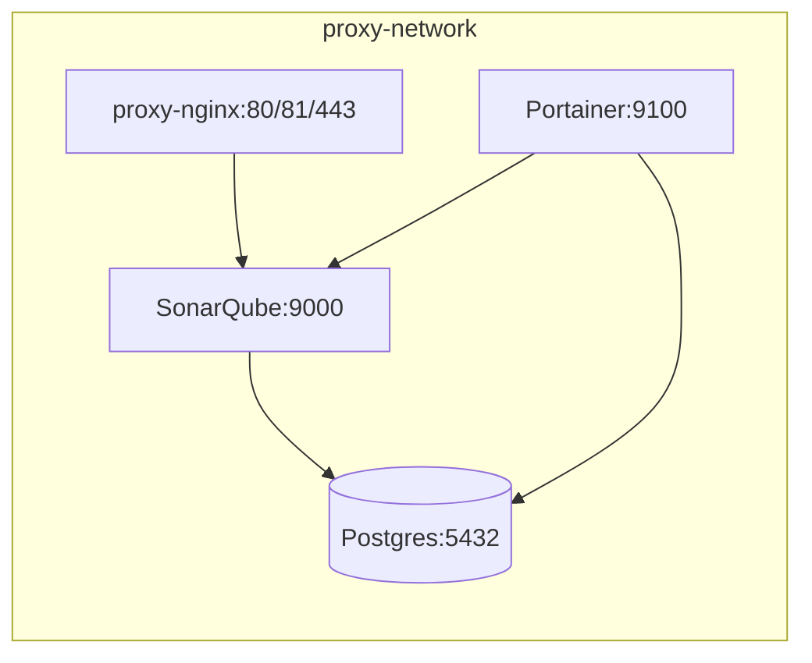
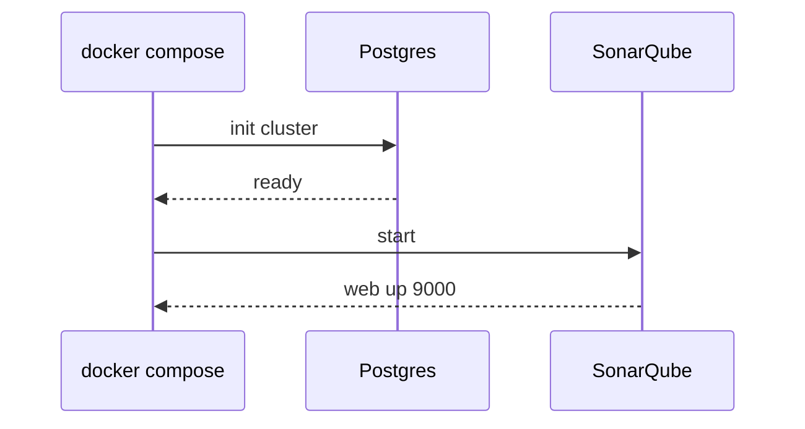

# Stack SonarQube

Análisis de calidad y seguridad de código con SonarQube + Postgres sobre la red compartida `proxy-network`.

## Componentes
| Servicio | Imagen | Puerto interno | Puerto host | Persistencia |
|----------|--------|----------------|-------------|--------------|
| sonarqube | sonarqube:latest | 9000 | 9000 | conf, extensions, logs, data |
| db (Postgres) | postgres:latest | 5432 | (no mapeado) | data |

## Arquitectura


## Flujo de arranque


## Volúmenes
| Volumen | Uso |
|---------|-----|
| sonarqube_conf | Configuración |
| sonarqube_extensions | Plugins |
| sonarqube_logs | Logs |
| sonarqube_data | Datos / índices |
| sonarqube_db_data | Datos Postgres |

## Backup rápido
Backup de datos SonarQube:
```
docker run --rm -v sonarqube_data:/from -v $(pwd):/to busybox sh -c 'tar czf /to/sonarqube_data.tgz -C /from .'
```
Dump DB:
```
docker exec -it sonarqube_db pg_dump -U sonarqube sonarqube > backup.sql
```

## Scanner (ejemplo)
`sonar-project.properties`:
```
sonar.projectKey=demo
sonar.projectName=Demo
sonar.sources=.
sonar.sourceEncoding=UTF-8
```
Ejecutar:
```
sonar-scanner -Dsonar.host.url=http://localhost:9000 -Dsonar.login=<TOKEN>
```

## Integración Proxy Manager
Crear Proxy Host apuntando a `sonarqube:9000`. Para subruta usar cabecera `X-Forwarded-Prefix`.

## Variables clave
| Variable | Servicio | Propósito |
|----------|----------|-----------|
| SONAR_JDBC_URL | sonarqube | Conexión Postgres |
| SONAR_JDBC_USERNAME | sonarqube | Usuario DB |
| SONAR_JDBC_PASSWORD | sonarqube | Password DB |
| POSTGRES_USER | db | Usuario inicial |
| POSTGRES_PASSWORD | db | Password |
| POSTGRES_DB | db | DB nombre |

## Troubleshooting
| Síntoma | Causa | Fix |
|---------|-------|-----|
| Arranque lento | Migraciones | Esperar 2-4 min |
| Auth DB falla | Credenciales desalineadas | Verificar SONAR_JDBC_* y POSTGRES_* |
| Plugins no persisten | Falta volumen extensions | Añadir volumen |
| Uso disco alto | Índices históricos | Limpieza UI |

## Mantenimiento
1. Logs: `docker logs -f sonarqube`.
2. Actualizar: `docker pull sonarqube:latest && docker compose up -d`.
3. Backup antes de upgrades mayores.

## Roadmap
* Contenedor sonar-scanner auxiliar.
* Export métricas Prometheus.
* Webhook quality gate.

## Créditos
SonarQube · Postgres
