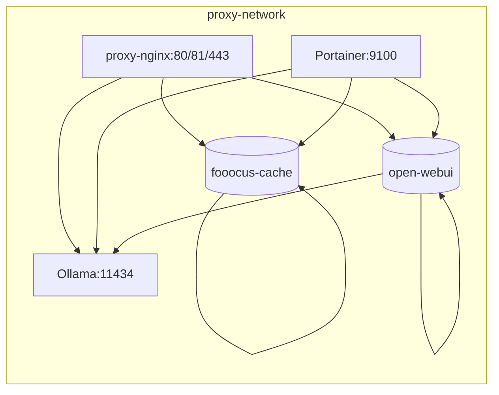

# Stack AI

Servicios de IA locales: Ollama (LLMs), OpenWebUI (UI), Fooocus (text-to-image).

## Componentes
| Servicio | Imagen/Base | Puerto interno | Puerto host | Persistencia |
|----------|-------------|---------------|-------------|--------------|
| ollama | ollama/ollama:latest | 11434 | (no mapeado) | (sin volumen) |
| openwebui | ghcr.io/open-webui/open-webui:main | 8083 | 3003 | `open-webui` |
| fooocus-api | build local | 8084 | 3004 | `fooocus-cache` |

## Arquitectura


## Flujo de arranque
1. Ollama inicia y opcionalmente descarga `OLLAMA_AUTO_PULL`.
2. OpenWebUI espera a Ollama.
3. Fooocus intenta GPU → fallback CPU.

## Pruebas rápidas
Listar modelos:
```
docker exec -it ollama ollama list
```
Inferencia:
```
docker exec -it ollama ollama run llama2 "Hola"
```
Ping Fooocus:
```
curl -sf http://localhost:3004 | head -n 5
```

## Variables clave
| Variable | Servicio | Uso |
|----------|----------|-----|
| OLLAMA_AUTO_PULL | ollama | Modelo inicial |
| OLLAMA_MAX_WAIT | ollama | Timeout readiness |
| CLI_ARGS | fooocus-api | Flags launch.py |
| CUDA_VISIBLE_DEVICES | fooocus-api | GPUs (vacío=CPU) |
| TORCH_FORCE_VERSION | build fooocus | Torch específica |
| INSTALL_TOOLKIT | build fooocus | Instala toolkit completo |

## Persistencia Ollama
```
  ollama:
    volumes:
      - ollama-data:/root/.ollama
volumes:
  ollama-data:
```

## Rebuild Fooocus
```
docker compose build --no-cache fooocus-api
docker compose up -d fooocus-api
```
Toolkit CUDA:
```
docker compose build --build-arg INSTALL_TOOLKIT=1 fooocus-api
```
Torch custom:
```
docker compose build --build-arg TORCH_FORCE_VERSION=torch==2.7.0+cu128 fooocus-api
```

## Salud / Diagnóstico
```
docker ps --format 'table {{.Names}}\t{{.Status}}\t{{.Ports}}'
docker logs -f stack-ai-fooocus-api-1
```
GPU Fooocus:
```
docker exec -it stack-ai-fooocus-api-1 python - <<'PY'
import torch;print(torch.__version__, torch.cuda.is_available(), torch.cuda.device_count())
PY
```

## Integración Proxy
| Host sugerido | Internal | Descripción |
|---------------|----------|-------------|
| openwebui.local | openwebui:8083 | UI LLM |
| ollama.local | ollama:11434 | API LLM |
| fooocus.local | fooocus-api:8084 | Text2Image |

## Problemas comunes
| Síntoma | Causa | Fix |
|---------|-------|-----|
| OpenWebUI vacío | Ollama no listo | Esperar / logs |
| Fooocus lento | Descarga modelos | Revisar cache |
| Error Torch GPU | GPU nueva | Fallback CPU / toolkit |
| Modelos perdidos | Sin volumen Ollama | Añadir ollama-data |

## Roadmap
* Monitor tamaño cache Fooocus.
* Limpieza selectiva modelos.
* Export prompts.

## Créditos
Ollama · OpenWebUI · Fooocus · PyTorch · Gradio
