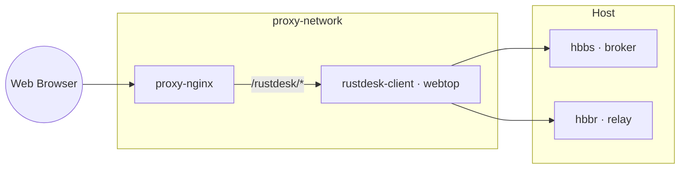

# Stack RustDesk 🧰 (Server + Cliente)

Servidor RustDesk autogestionado con hbbs (broker) y hbbr (relay) en red host. Cliente dentro de un escritorio web (webtop) servido vía Nginx Proxy Manager.

## 🧩 Componentes
| Servicio | Imagen | Modo red | Persistencia |
|----------|--------|----------|--------------|
| hbbs     | rustdesk/rustdesk-server:latest | host | ./data -> /root |
| hbbr     | rustdesk/rustdesk-server:latest | host | ./data -> /root |
| rustdesk-client | local/rustdesk-client-webtop | proxy-network (host-gateway) | ./client-config |

## 🗺️ Arquitectura


## ⚡ Uso rápido
Levantar el stack:
```bash
cd stack-rustdesk
docker compose up -d
```
Configura un Proxy Host/Subruta en NPM para el cliente (ej. /rustdesk/).

## 🔐 Notas de seguridad
- Asegura el firewall para los puertos de hbbs/hbbr.
- `host.docker.internal` mapeado via host-gateway para que el cliente alcance hbbs/hbbr.
- Respalda `./data` y `./client-config`.

## 🩺 Troubleshooting
- Logs: `docker logs -f hbbs`, `docker logs -f hbbr`, `docker logs -f rustdesk-client`.
- AppImage: define `RUSTDESK_APPIMAGE_URL` o coloca `./client-config/apps/rustdesk.AppImage`.

## 🙏 Créditos
RustDesk · linuxserver/webtop
